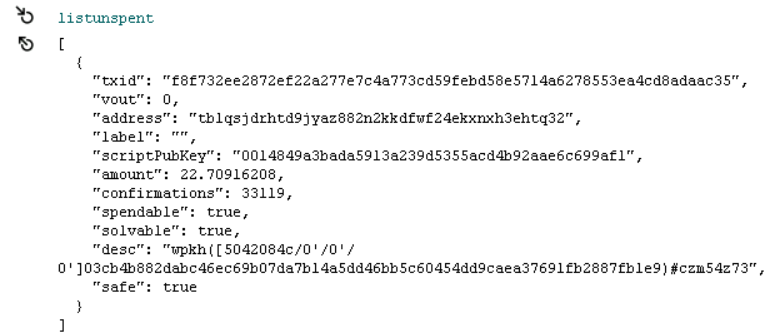
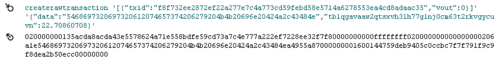
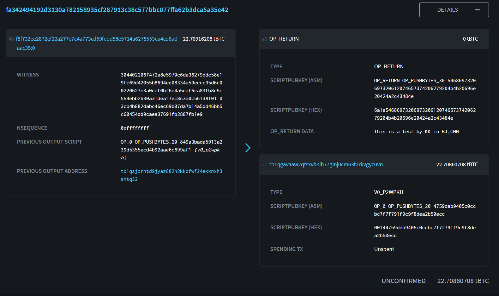

# 在比特币区块链上刻字​
这项任务我们可以在BTC Testnet上进行验证。当真正需要有纪念性意义的东西想要记录在主网Mainnet上的时候，我们可以按照同样的方法进行操作。但是就需要从交易所购买提现，过程要再复杂一些，中间还需要提现手续费等。相关的技巧策略在本文最后介绍~

首先我们从测试网的水管
## 获取到测试网的代币

下载Bitcoin Core，在启动的快捷方式当中添加参数-testnet，之后启动图标就会变成绿色。
## 创建一个钱包
等待区块同步完毕，创建一个钱包，之后点击“接收”，点击“创建新的收款地址”。这样我们就获得到了一个测试网的地址。


（上图仅为样例。在后文的例子当中，领取到的测试代币在`tb1qsjdrhtd9jyaz882n2kkdfwf24ekxnxh3ehtq32`当中，之后我又创建了找零地址`tb1qgavaaw2qtsxvh3lh77glnj0cm63t2rkvgycuvn`）

之后我们可以在测试网水管的网站上填写这个地址，就可以获得到测试网的代币了。

等待测试代币到帐后，我们打开Bitcoin Core的控制台。具体位置：窗口-控制台。

## 查看可以使用的UTXO

```
listunspent
```



 可以看到我们现在有一笔22.70916208BTC的UTXO，是由交易`f8f732ee2872ef22a277e7c4a773cd59febd58e5714a6278553ea4cd8adaac35`创建的第`0`个输出创建的。

## 想好要创建的内容。
这里我要刻下的内容是：
```
This is a test by KK in BJ,CHN
```
将其转为hex格式：
```
5468697320697320612074657374206279204b4b20696e20424a2c43484e
```
之后我们要把这个UTXO花费掉，并且创建两个输出，一个输出包含我们要刻字的内容，该输出并不包含实际的比特币，另一笔则是常规的地址转账输出，接收找零的地址为`tb1qgavaaw2qtsxvh3lh77glnj0cm63t2rkvgycuvn`。找零的value是原先UTXO的面额-矿工费（根据交易时的网络情况，会有建议的手续费，按照? Sat/kB计算。）

## 创建RAW交易
下面这行命令解析：

>txid后的内容，是前面UTXO的txid，vout也一样。  
>data后的内容，就是要刻字的hex  
>后面的tb1qgavaaw2qtsxvh3lh77glnj0cm63t2rkvgycuvn是我接收找零的地址。在实际当中替换成你自己的找零地址。

这里我支付的矿工费是`0.00055500BTC`。
所以我们填写找零金额为22.70916208-0.000555000=**22.70860708**

```
createrawtransaction '[{"txid":"f8f732ee2872ef22a277e7c4a773cd59febd58e5714a6278553ea4cd8adaac35","vout":0}]' '{"data":"5468697320697320612074657374206279204b4b20696e20424a2c43484e","tb1qgavaaw2qtsxvh3lh77glnj0cm63t2rkvgycuvn":22.70860708}'
```
这里有一个很重要的点。**UTXO的基本特性就是不可分割。要想花费掉这个UTXO就必须花掉他所有的金额，用作交易输入**。那么我们
**如果不设置找零接收的话，就会导致所有的UTXO包含的比特币都被用做了矿工费，这是非常危险的事情。**
所以一定要创建两个交易输出用作找零。**手续费的计算方法就是交易输入的总和-交易输出的总和**。



## 对这个raw交易进行签名，组装。

这里的参数内容就是上一步的输出
```
signrawtransactionwithwallet 020000000135acda8acda43e5578624a71e558bdfe59cd73a7c4e777a222ef7228ee32f7f80000000000ffffffff020000000000000000206a1e5468697320697320612074657374206279204b4b20696e20424a2c43484ea4955a87000000001600144759deb9405c0ccbc7f7f791f9c9f8dea2b50ecc00000000
```

在最终广播交易之前，为了保险起见，我们可以使用decoderawtransaction来对要广播的
## 交易进行最终验证。

```
21:54:29

decoderawtransaction 0200000000010135acda8acda43e5578624a71e558bdfe59cd73a7c4e777a222ef7228ee32f7f80000000000ffffffff020000000000000000206a1e5468697320697320612074657374206279204b4b20696e20424a2c43484ea4955a87000000001600144759deb9405c0ccbc7f7f791f9c9f8dea2b50ecc0247304402206f472a8e5970c6da36279ddc58e19fc69d42055b8694ee08334a59eccc35d6c00220627e3a0cef0bf6e4a5eaf6ca83fb8c5c554ebb2530a31deaf7ec8c3a0c56138f012103cb4b882dabc46ec69b07da7b14a5dd46bb5c60454dd9caea37691fb2887fb1e900000000


21:54:29

{
  "txid": "fa342494192d3130a782158935cf287913c38c577bbc077ffa62b3dca5a35e42",
  "hash": "e14594587963f3eb6261b78f872ca207768947ec4c569ed11501f34f0f3d7b1b",
  "version": 2,
  "size": 232,
  "vsize": 151,
  "weight": 601,
  "locktime": 0,
  "vin": [
    {
      "txid": "f8f732ee2872ef22a277e7c4a773cd59febd58e5714a6278553ea4cd8adaac35",
      "vout": 0,
      "scriptSig": {
        "asm": "",
        "hex": ""
      },
      "txinwitness": [
        "304402206f472a8e5970c6da36279ddc58e19fc69d42055b8694ee08334a59eccc35d6c00220627e3a0cef0bf6e4a5eaf6ca83fb8c5c554ebb2530a31deaf7ec8c3a0c56138f01",
        "03cb4b882dabc46ec69b07da7b14a5dd46bb5c60454dd9caea37691fb2887fb1e9"
      ],
      "sequence": 4294967295
    }
  ],
  "vout": [
    {
      "value": 0.00000000,
      "n": 0,
      "scriptPubKey": {
        "asm": "OP_RETURN 5468697320697320612074657374206279204b4b20696e20424a2c43484e",
        "hex": "6a1e5468697320697320612074657374206279204b4b20696e20424a2c43484e",
        "type": "nulldata"
      }
    },
    {
      "value": 22.70860708,
      "n": 1,
      "scriptPubKey": {
        "asm": "0 4759deb9405c0ccbc7f7f791f9c9f8dea2b50ecc",
        "hex": "00144759deb9405c0ccbc7f7f791f9c9f8dea2b50ecc",
        "reqSigs": 1,
        "type": "witness_v0_keyhash",
        "addresses": [
          "tb1qgavaaw2qtsxvh3lh77glnj0cm63t2rkvgycuvn"
        ]
      }
    }
  ]
}
```
确认无误
## 发送此交易

```
21:58:04

sendrawtransaction 0200000000010135acda8acda43e5578624a71e558bdfe59cd73a7c4e777a222ef7228ee32f7f80000000000ffffffff020000000000000000206a1e5468697320697320612074657374206279204b4b20696e20424a2c43484ea4955a87000000001600144759deb9405c0ccbc7f7f791f9c9f8dea2b50ecc0247304402206f472a8e5970c6da36279ddc58e19fc69d42055b8694ee08334a59eccc35d6c00220627e3a0cef0bf6e4a5eaf6ca83fb8c5c554ebb2530a31deaf7ec8c3a0c56138f012103cb4b882dabc46ec69b07da7b14a5dd46bb5c60454dd9caea37691fb2887fb1e900000000


21:58:04

fa342494192d3130a782158935cf287913c38c577bbc077ffa62b3dca5a35e42
```
<https://blockstream.info/testnet/tx/fa342494192d3130a782158935cf287913c38c577bbc077ffa62b3dca5a35e42?expand>

点击DETAILS的+号，我们可以看到我们已经成功刻字 

很快，我们的交易就会被打包上链。之后经过一段时间后的交易确认，刻字成功。

# 主网Mainnet
在MainNet上面，手续费其实并不会很贵。可以根据国外的一些实时手续费建议的网站选取合适的手续费。手续费是按照虚拟字节收费的，也就是(?) Satoshi / vByte。

<https://privacypros.io/tools/bitcoin-fee-estimator/>


如果采用的是隔离见证，那么需要按照虚拟字节计算手续费。常规交易就直接按照字节数计算即可。有些钱包软件会故意大幅度的提升交易手续费，有点不讲武德。。

交易提现的话，2022-02验证，OKX交易所是手续费最低的，0.002BTC就可以提现。