# 准备文件：

最新版的geth，下载地址<https://geth.ethereum.org/downloads/>

安装的时候选择**Development tools**

设计创世区块的内容：
```json
{
  "config": {
    "chainId": 666,
    "homesteadBlock": 0,
    "eip150Block": 0,
    "eip150Hash": "0x0000000000000000000000000000000000000000000000000000000000000000",
    "eip155Block": 0,
    "eip158Block": 0,
    "byzantiumBlock": 0,
    "constantinopleBlock": 0,
    "petersburgBlock": 0,
    "istanbulBlock": 0,
    "ethash": {}
  },
  "nonce": "0x0",
  "timestamp": "0x5ddf8f3e",
  "extraData": "0x0000000000000000000000000000000000000000000000000000000000000000",
  "gasLimit": "0x47b760",
  "difficulty": "0x00002",
  "mixHash": "0x0000000000000000000000000000000000000000000000000000000000000000",
  "coinbase": "0x0000000000000000000000000000000000000000",
  "alloc": { },
  "number": "0x0",
  "gasUsed": "0x0",
  "parentHash": "0x0000000000000000000000000000000000000000000000000000000000000000"
}
```
这里要着重注意一下chainid，这里可以自定义编号。也是私链的一个标志。

保存此文件为genisus.json，创建文件夹MyChain


# 运行命令创建创世区块
```bash
geth init genesis.json --datadir "MyChain"
```

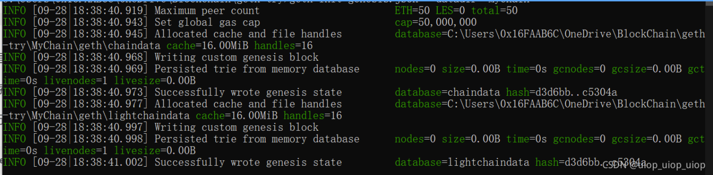

可以看到MyChain目录下的内容

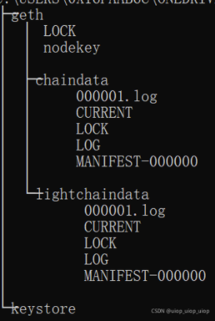

# 启动geth客户端
此处注意自己设置的networkid

geth --datadir "MyChain" --networkid 2333 --http --http.corsdomain "*" --http.api eth,net,web3,personal --nodiscover --allow-insecure-unlock console
生成以太坊账户


personal.newAccount()
personal.newAccount("password")
 从控制台输入密码为pwd

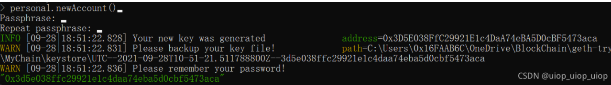

 直接传入密码为password

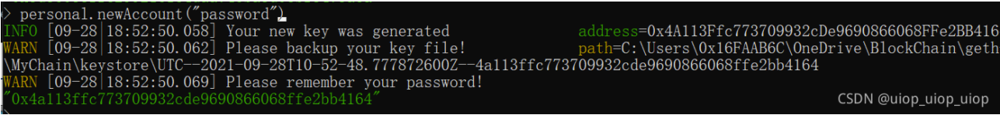

最下面的绿色字就是新生成的地址

直接查看账户的余额，现在是0wei

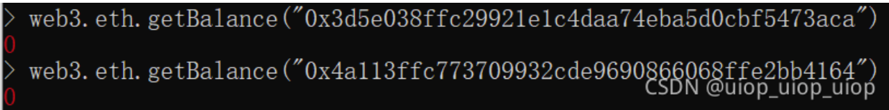

 在使用账户进行挖矿或者交易之前，首先需要将默认锁定的账户进行解锁。解锁账户需要密码。这个解锁函数可以后面加参数time，设置账户的解锁时间。

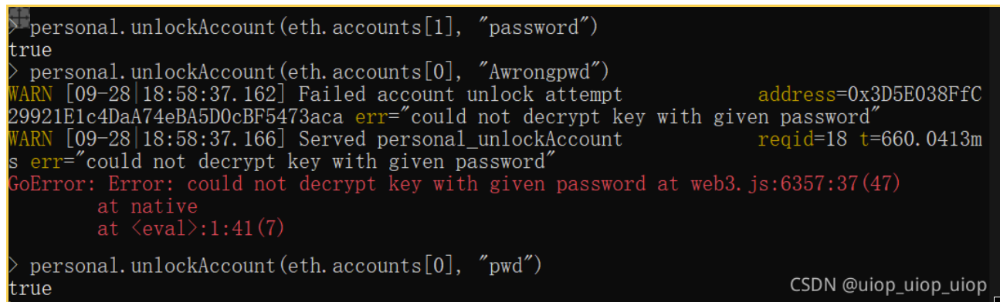

 设置挖矿的coinbase

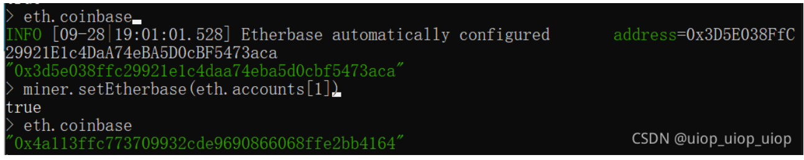

 开始挖矿

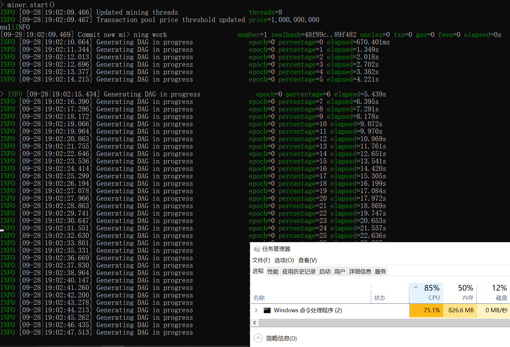

 此时开始挖矿并产生收益

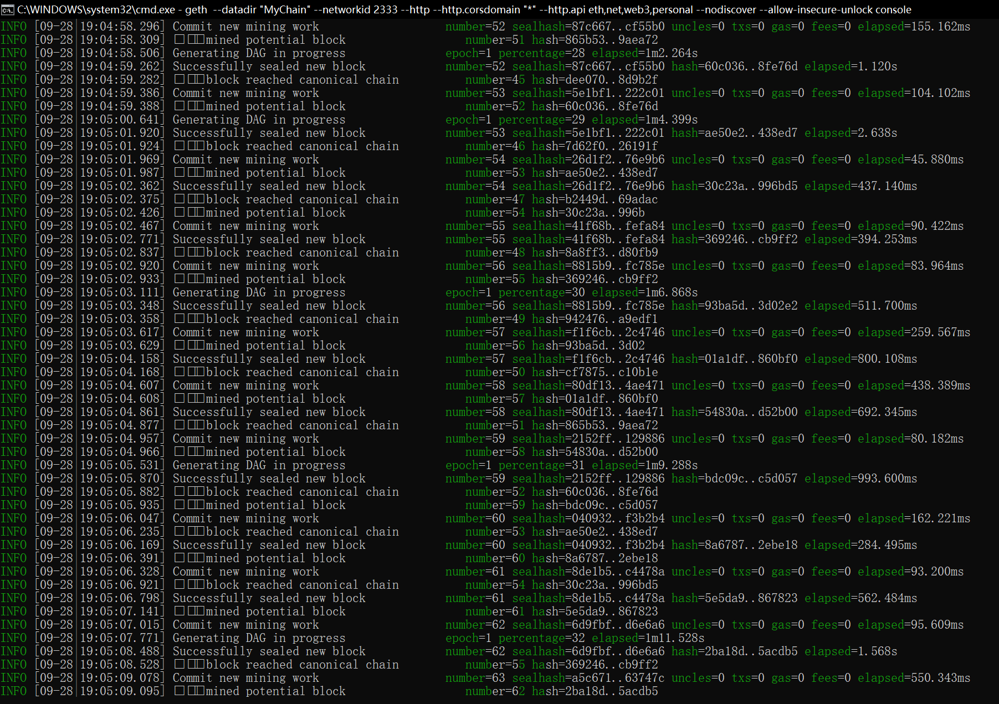

  直接定着一堆多线程输出的log进行输入。可以选择miner.stop()。更方便一些

这里可以查看已经挖出来的ether（但是这里发现，在这种情况下重新启动geth，这里的余额就没有了）

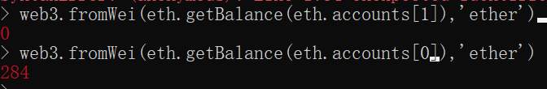

 也可以设置只挖一定数量的ether

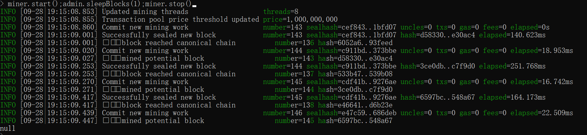

 因为卡住重启了，这里需要重新挖矿。

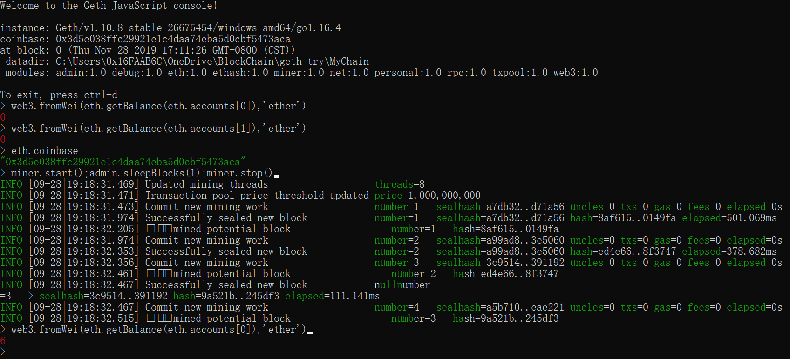

 发送交易

 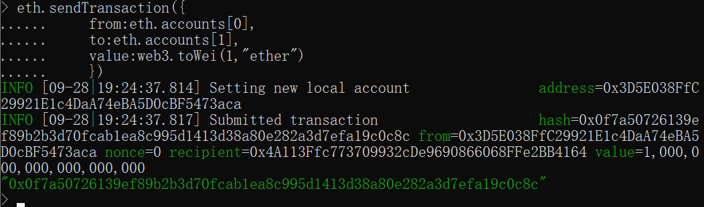

 查看内存池当中的交易

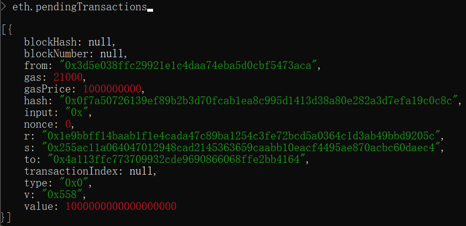

 因为这里还没有矿工挖矿打包。现在交易并没有被确认。

这里开启矿工，挖一个区块去打包

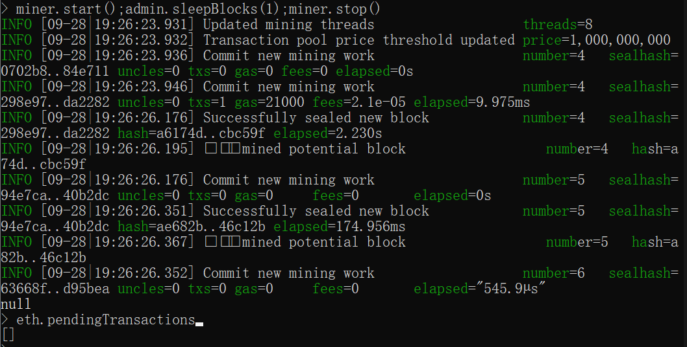

 这样就打包了这个交易

账户余额发生了变化。

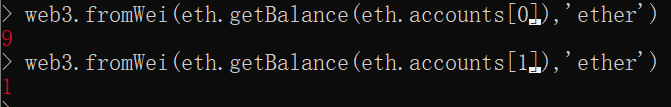

安装metamask钱包，添加rpc

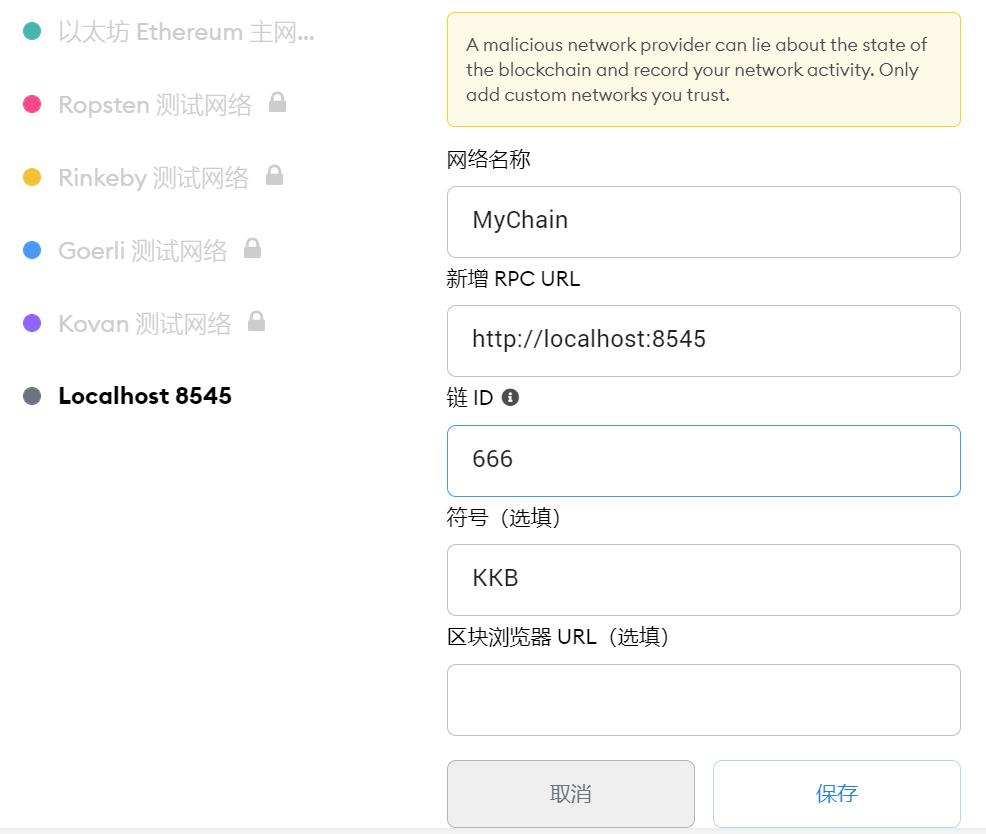