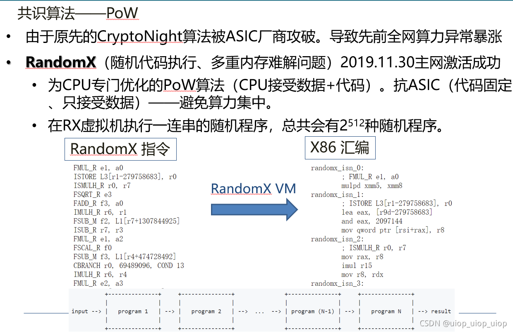
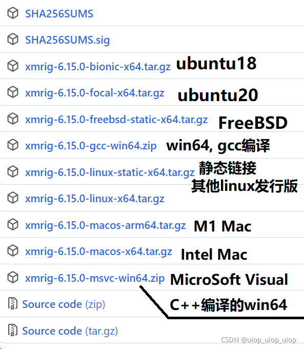
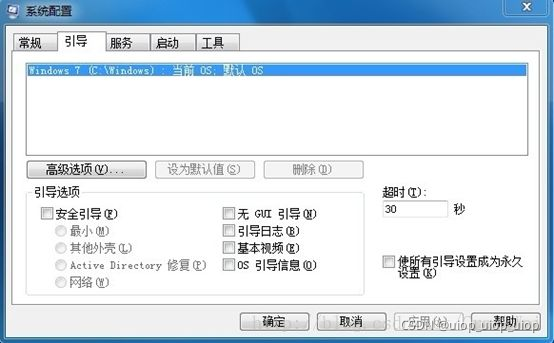
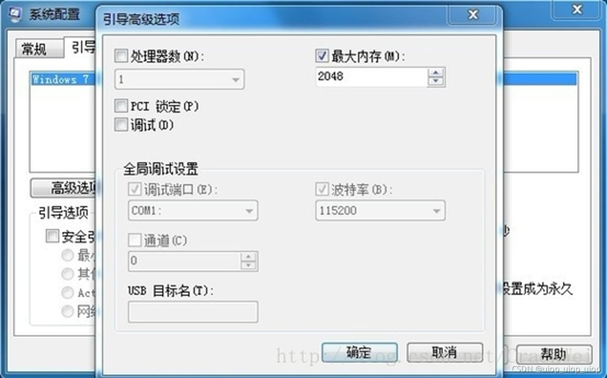
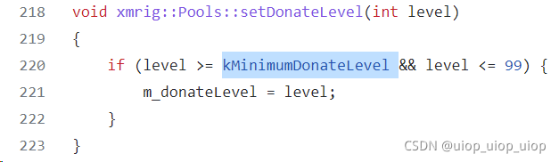
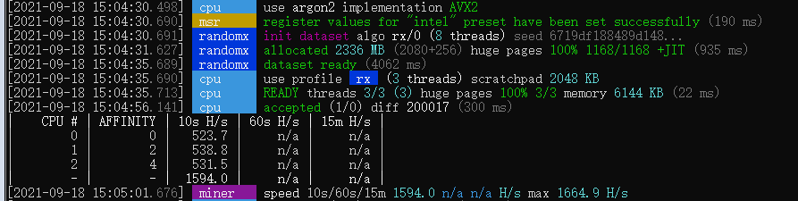

# 门罗币(XMR)挖矿教程与分析

> 免责声明：目前国家禁止大规模挖矿。个人可以作为学术研究探索来进行挖矿的尝试。因参考本教程所导致的任何纠纷或者法律问题与作者本人无关！

# 基础知识了解 
 PoW挖矿，是指采用硬件不断完成计算，来争夺区块链网络上区块记账权的过程。

门罗币的挖矿共识算法RandomX是采用的CPU挖矿。因为随机执行的特性，让ASIC芯片并没有远超出CPU的特殊优势。一图了解RandomX



# 挖矿所需环境 
直接参考Benchmark。

 
RandomX Benchmark - XMRig
https://xmrig.com/benchmark

挖门罗币最好的设备是多核多线程，多通道内存的服务器CPU。如果您是想要较大规模挖矿的话，建议可尽可能多的在一块主板上放置CPU。比如多路服务器，广达双子星系列等。

**需要安装操作系统为64bits，内存大小4GB以上。建议配置多通道内存。**

# 挖矿软件配置
## 下载XmRig
Releases · xmrig/xmrig · GitHub
https://github.com/xmrig/xmrig/releases


对于Linux，下载对应的版本。

对于Windows，推荐下载MSVC的版本。GCC的算力在某些情况下会略低一点。具体的可以都下载下来试一下，整体差别不是很大。

对于Mac，下载对应的芯片版本。

## 配置内存大小及虚拟内存（优化部分，条件不允许可省略）
### 内存大小配置
开始-运行-msconfig-引导选项卡



点击高级选项，弹出引导高级选项对话框后，勾选最大内存，并设置一个数值，该数值为最大可用内存限定值（可直接设置为你电脑内存的大小，比如8G则为8 * 1024=8192；)



 设置完之后要重启。

### 配置虚拟内存
虚拟内存至少设置为4GB以上。

### 0抽水编译修改
门罗币挖矿客户端xmrig的无抽水修改及编译 - 知乎

https://zhuanlan.zhihu.com/p/100083701



## 创建门罗币钱包
 一种是本地钱包，亦称冷钱包，一种是在线钱包，也就是我们常说的热钱包。

本地钱包的优点是安全，密钥不容易被窃取，缺点是同步钱包很麻烦，有可能同步一两天都同步不完。热钱包的优点是方便，不需要开电脑同步；缺点是安全性不能保障。

冷钱包的官网下载地址： https://getmonero.org/downloads/
热钱包也请使用官方推荐的： https://mymonero.com/#

# 正式运行
## 基础单机矿池直连运行
这个软件的最低抽水是1%，每计算99分钟，帮作者计算1分钟。优化方法见优化部分。

命令行：
```
xmrig.exe -B --donate-level 0 -o 【矿池地址】:【矿池端口】-u 【钱包地址】 -p x -k
```
注意运行的时候要用管理员模式才可以注册WinRing0驱动，使用msr寄存器加快挖矿运行。

 5分钟之内，矿池页面就会显示当前的Hashrate。


## 多机采用Xmrig-Proxy聚合
​