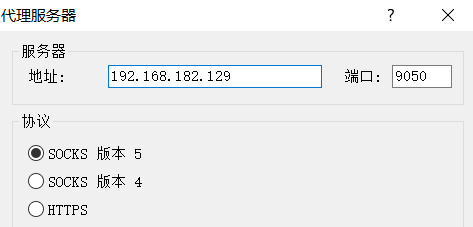
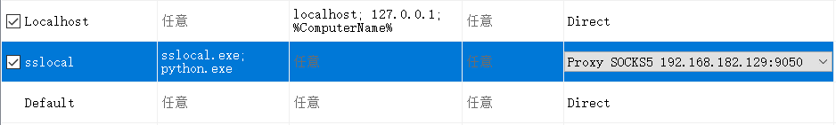
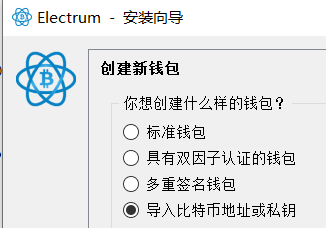
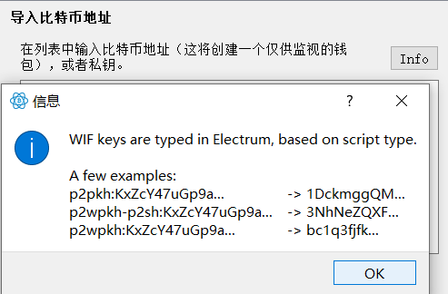
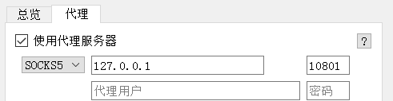
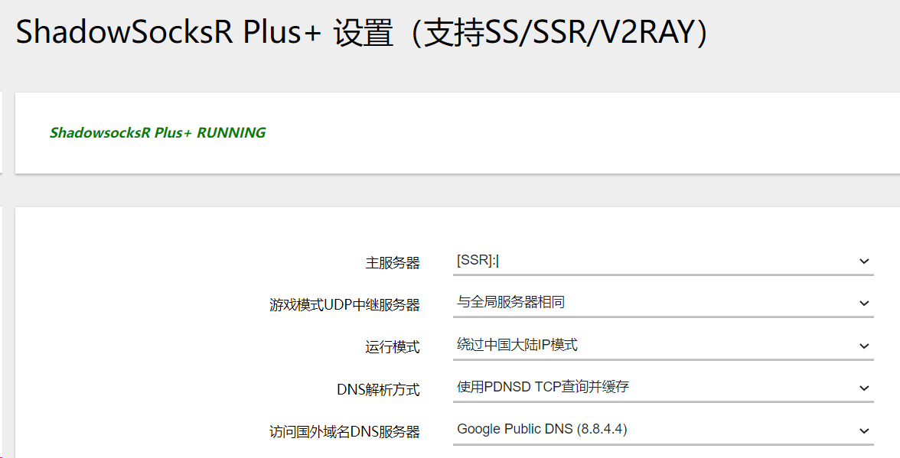
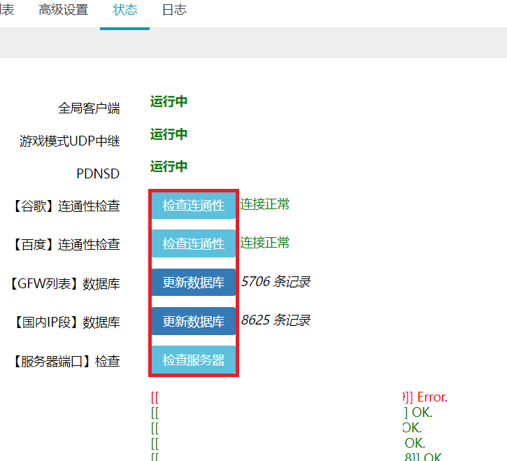

# 抓取流经Tor网络的入口流量和出口流量

## 整体宏观路线：
要抓取的访问远端服务器都是显网地址。

原因：需要可靠数据来源，onion节点大多数都存在欺骗情况。
### 所在网络没有限制tor流量
不使用网桥：（不使用网桥就是，入口走的是guard，不走bridge）

normal client --(socks5 option)--> sslocal --(proxifier)--> tor (CAPTURE)--> [guard --> relay --> relay] --> (Capture)ssserver --> normal server

### 所在网络限制了tor流量
不使用网桥：

normal client --(socks5 option)--> sslocal --(proxifier)--> tor (CAPTURE)--> {ssr client --> ssr server} --> [guard --> relay --> relay] --> (Capture)ssserver --> normal server

{}部分，由特制的路由器完成，转发tcp, udp到ssr服务器。路由器整体呈现透明代理的情况。

---

## 技术实现部分
### 环境选型
- Windows 10 x64 （本地物理机）
  - 钱包客户端软件Electrum --testnet
  - sslocal
  - Proxifier
- Ubuntu 18.04 x64 Desktop （本地虚拟机，NAT模式网卡）
  - tor
  - obfs4proxy
  - tcpdump
- Ubuntu 18.04 x64 Server （不会屏蔽Tor Exit Relay传入连接的境外VPS）
  - ssserver
  - tcpdump
- PandoraBox 18.12 透明代理 （本地物理机连接的路由器，自动转发非国内IP到远程SSR服务器）
  - 小米路由器3
  - ShadowSocksR Plus+

---

### 本地物理机配置
#### sslocal
安装Python，勾选Add Python to PATH，之后
```bash
pip install shadowsocks
```
2022-03-20，安装的版本号为2.8.2

> 为避免`Exception: libcrypto(OpenSSL) not found`需要安装OpenSSL
> 
> > OpenSSL 3.0.2 https://slproweb.com/download/Win64OpenSSL-3_0_2.exe
> >
> > VC_redist.x64 https://download.visualstudio.microsoft.com/download/pr/b929b7fe-5c89-4553-9abe-6324631dcc3a/296F96CD102250636BCD23AB6E6CF70935337B1BBB3507FE8521D8D9CFAA932F/VC_redist.x64.exe
> >
> > 安装最后选择，将dll放到Windows目录当中
> >
> > 转到C:\Windows\System32，找到libcrypto.dll，libssl.dll（原始是带版本号的），去掉他们的版本号。
> 
> 如果`undefined symbol: EVP_CIPHER_CTX_cleanup`，需要更新OpenSSL新版本废弃的函数。
> 
> 转到C:\Users\Administrator\AppData\Local\Programs\Python\Python38\Lib\site-packages\shadowsocks\crypto下，修改openssl.py
>
> 将`EVP_CIPHER_CTX_cleanup`全部替换成`EVP_CIPHER_CTX_reset`（2.8.2版本中有两处）

配置就绪后，命令行启动如下
```
sslocal -s 158.247.217.175 -p 9999 -b 0.0.0.0 -l 10801 -k qweqwe
```

---

#### Proxifier
*强大的可选自定义的系统级流量切换代理工具。*

工具栏：配置文件-代理服务器-添加


配置文件-代理服务器-代理规则



---

#### Electrum
https://download.electrum.org/4.2.0/electrum-4.2.0-setup.exe

因为要发送大量交易，我们用测试网模式启动。

```bash 
electrum-4.1.5.exe --testnet
```



这里我们已经有一个有大量测试网的比特币的钱包私钥。在导入私钥的时候要注意在私钥前面加上钱包类型，不然余额会无法显示。输入方式参考图片。

> 我的钱包原来在bitcoin core中。直接在bitcoin core当中
> ```
> dumpprivkey [ADDRESS]
> ```
>　这样导出了一个未加密钱包的私钥，导入到electrum当中。

导入成功之后，我们设置代理

菜单栏：工具-网络-代理

如下填写，勾选之后立即生效。


---
---

### 本地虚拟机配置
VMWware 16.0, Ubuntu 18.04 (bionic)

NAT模式网卡。

#### Tor
```bash
cd Browser/TorBrowser/Tor
sudo find ./ -type f -name "*.so*" -exec cp \{\} /usr/lib \;
cp ../Data/Tor/torrc-defaults ./
```
```bash
sudo ./tor -f ./torrc-defaults
```
#### tcpdump
```bash
tcpdump -i ens33 -w 1.pcap -v
```
---
---
### 境外VPS配置

#### sserver
```bash
pip3 install wheel
pip3 install shadowsocks
```
添加了vultr网关那的防火墙之后，也要在系统防火墙（默认就是iptables）上放行
```bash
iptables -A INPUT -p tcp --dport 9999 -j ACCEPT
```
```bash
sserver -p 9999 -k qweqwe
```
> 如果`undefined symbol: EVP_CIPHER_CTX_cleanup`，同样的，需要更新OpenSSL新版本废弃的函数。
> 
> 转到/usr/local/lib/python3.6/dist-packages/shadowsocoks/crypto下，修改openssl.py
>
> 将`EVP_CIPHER_CTX_cleanup`全部替换成`EVP_CIPHER_CTX_reset`（2.8.2版本中有两处）
#### tcpdump
```bash
tcpdump -i enp1s0 -w 1.pcap -v
```
---
---
### 透明代理路由器配置
小米路由器3
刷入PandoraBox
```
opkg update
opkg install luci-app-ssr-plus
```


